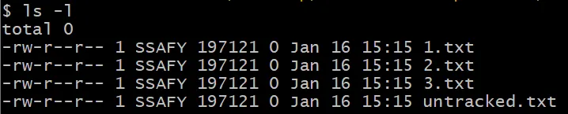
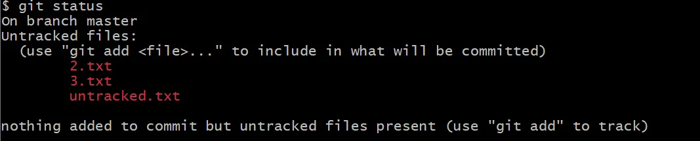
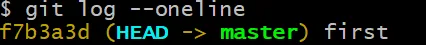
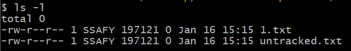
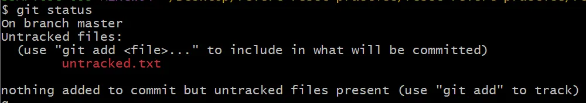
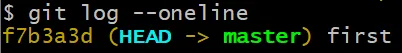
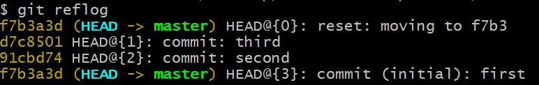
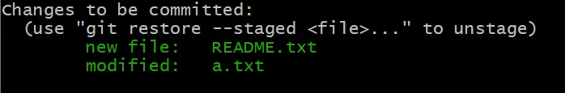
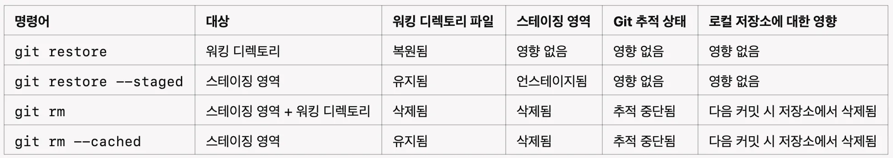

# git reset


## git reset - soft <해시번호> 🦁

- 작업 영역 유지


- 삭제된 것은 stage 영역에 남아있음


- 커밋 기록은 삭제 (그러나 사실 데이터베이스에는 남아있음)


## git rest --mixed <해시번호> 🐯


- 작업 영역 유지



- stage 영역 추적 안됨



- 커밋 기록 삭제




## git reset --hard <해시번호> 🦒


- 작업 영역 삭제



- stage 영역 삭제



- 커밋 기록삭제




# git reflog 🐱
```
 reset --hard 옵션을 통해 지워진 commit 조회하여 복구 가능
```




# git restore 🦓


- git restore <파일명>

    - 이미 커밋된 파일이 있는 경우
    - 해당 파일을 수정했는데, 수정한 것이 마음에 안 들어서 커밋된 파일로 복원하고 싶은 경우
    - 커밋에 들어있는 파일을 복사해서, 작업 영역에 있는 파일에 덮어쓰기


# unstage 하고 싶을때 (giit add를 취소하고 싶을 때) 🦊




 - git rm --cached
    - commut이 없을 때
    - stage 영역에서 제외하면서, 그 다음 삭제하는 커밋을 만들게 됨

 - git restore --staged[권장]
    - commit이 있을 때도 가능
    - 스테이지 영역에서만 삭제, 작업영역은 그대로

 - git restore
    - 커밋에서 복사해서 작업 영역 내용 덮어쓰기(복원)


# 정리 🐶




 - git rm은 gir reset --hard와 비슷하다
    - gir rm은 다음 커밋에서 삭제
    - gir reset --hard는 커밋해버림

 - git add를 취소하고 싶다면 git restore --staged 파일명 쓸 것

  


